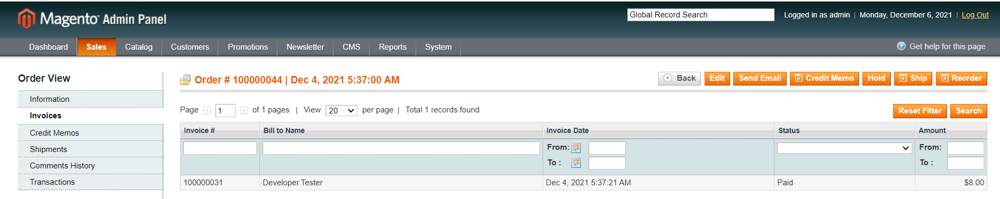
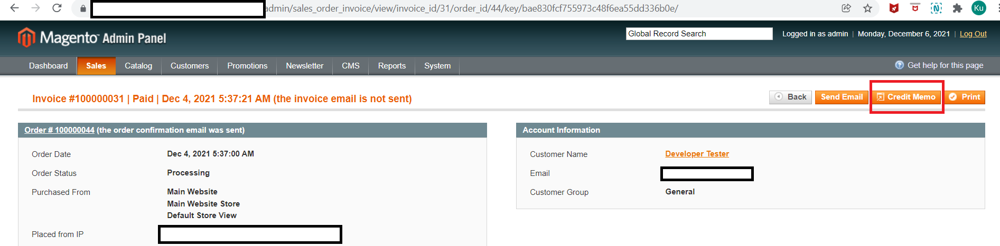
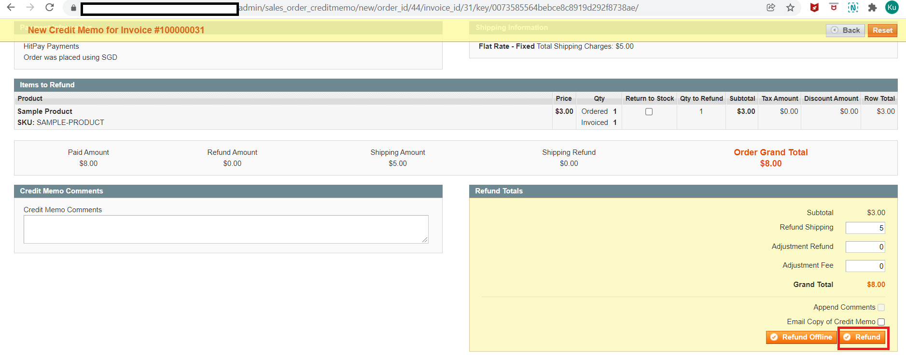
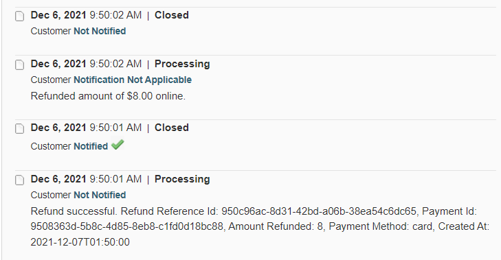

# HitPay Gateway Extension for Magento 1

[**HitPay**](https://www.hitpayapp.com/) provides a seamless payment experience for your customers and an easy integration process for the developers. Hitpay payment works by creating Payment Request and then the customers accepting the Payment Request.

## Step 1: install module

copy files from the archive into the core project folder.  

clean cache of magento

## Step 2: Configuration the extension

You need to have Api Key and Salt. These values can be obtained from Settings > Payment Gateway > API Keys in the HitPay Web Dashboard at [this link](https://dashboard.hit-pay.com/) after registration

After set up the Api Key and Salt You need also to clean cache and you can go to checkout page

## Refunds
1. Log in to Admin
2. Navigate to Sales ⇒ Orders
3. Click view link to navigate to Admin Order Details page.
4. Click Invoices tab as shown in the screen, an invoice would have been created if order is paid via 'HitPay Payment Gateway' and payment is successful and transaction id saved on the Database.
5. Click the row in the invoices list to go to invoice page.

6. Click the Credit Memo button at the top to initiate Online Refund request.
[Note: Please do remember and make sure, you have to navigated into invoice page and click the Credit memo button to initiate the Online Refund Request with HitPay Payment Gateway.
If you click the Credit Memo button in other pages, Magento will provide option to Refund offline only]

7. Now click the 'Refund' button (marked red color in the screen) to request the Refund with HitPay Payment Gateway through online/api.

8. If gateway accepted the refund request and the Refund details will be added to order history.
9. Only one refund is allowed per transaction.
10. Refund is only applicable if the initial charge was made with PayNow or Card.

## Changelog

= 1.0.0 =
* Initial release.

== Upgrade Notice ==

= 1.2.1 =
- Added FPX and Zip Payment logos selection

= 1.2.2 =
- Added Atome and Billease, GCash, Union Bank, QRPH, PESONet logos