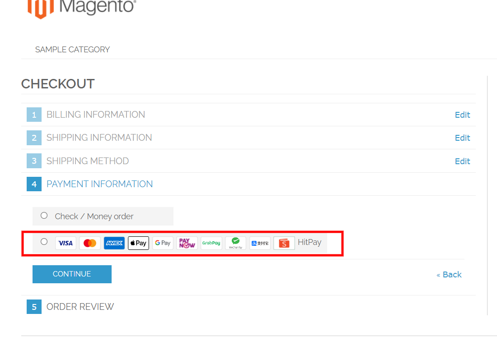

# HitPay Gateway Extension for Magento 1

[**HitPay**](https://www.hitpayapp.com/) provides a seamless payment experience for your customers and an easy integration process for the developers. Hitpay payment works by creating Payment Request and then the customers accepting the Payment Request.

## Step 1: install module

copy files from the archive into the core project folder.  

clean cache of magento

## Step 2: Configuration the extension

You need to have Api Key and Salt. These values can be obtained from Settings > Payment Gateway > API Keys in the HitPay Web Dashboard at [this link](https://dashboard.hit-pay.com/) after registration

After set up the Api Key and Salt You need also to clean cache and you can go to checkout page

